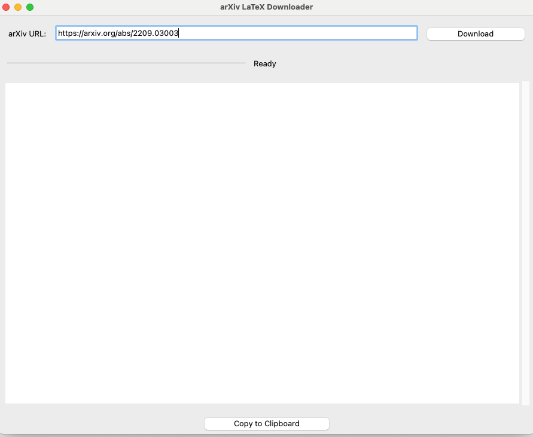
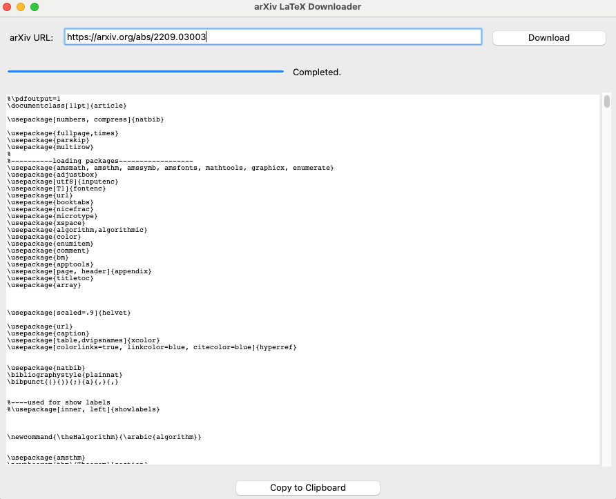

# arXiv LaTeX Downloader




**arXiv LaTeX Downloader** is a Python desktop application that allows users to easily download and consolidate LaTeX source files from arXiv submissions. Ideal for researchers who want to use them as LLM inputs.

## Features

- **Simple GUI**: User-friendly interface built with Tkinter.
- **Download LaTeX Sources**: Input an arXiv link to fetch the corresponding LaTeX source.
- **Combine `.tex` Files**: Automatically merges multiple `.tex` files into a single document.
- **Progress Indicators**: Visual feedback during download and processing.
- **Caching**: Stores downloaded sources locally for faster future access.
- **Copy to Clipboard**: Easily copy the consolidated LaTeX source.

## Installation

### Prerequisites

- **Python 3.x**
### Steps

1. **Clone the Repository**

   ```bash
   git clone https://github.com/yourusername/arxiv-latex-downloader.git
   cd arxiv-latex-downloader
   ```

2. **Install Dependencies**

   ```bash
   pip install -r requirements.txt
   ```

## Usage

   ```bash
   python main.py
   ```

   Using the GUI:
   - Enter arXiv URL: Input the desired arXiv link (e.g., https://arxiv.org/abs/2301.12003).
   - Download: Click the "Download" button to fetch and process the LaTeX source.
   - View Source: The combined LaTeX code will appear in the text area.
   - Copy to Clipboard: Click the "Copy to Clipboard" button to copy the LaTeX source for use elsewhere.